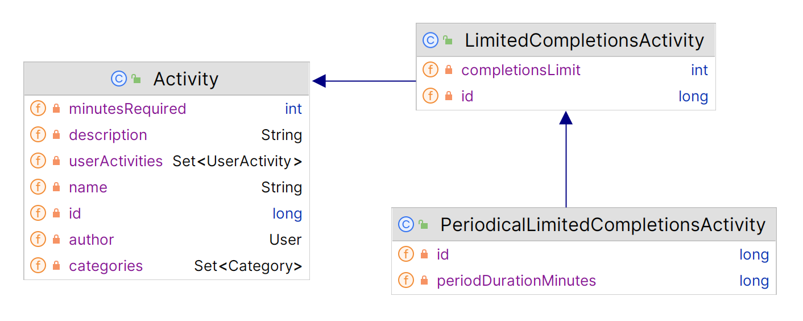
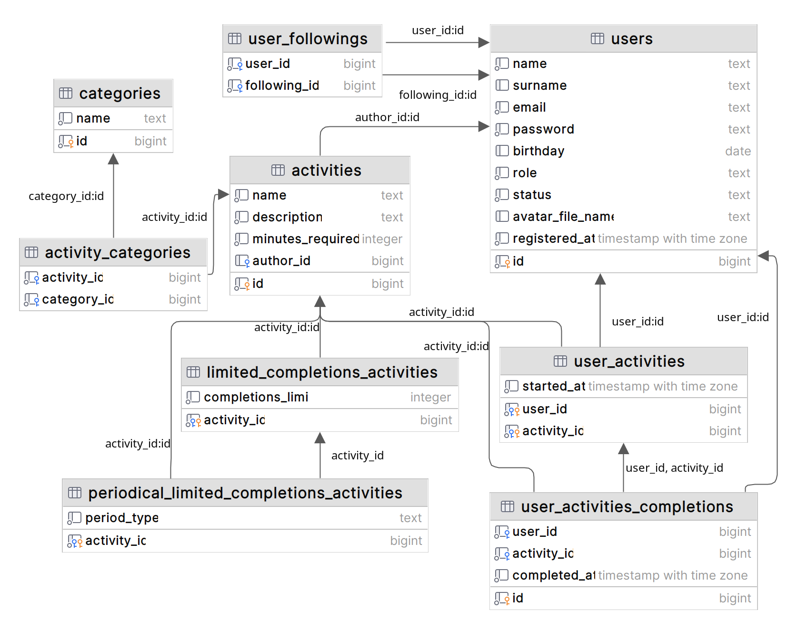

# Self-improvement social network - REST API built with Spring

*Client app built with Angular and Bootstrap resides in a separate repo:* 
https://github.com/ruslan-ks/self-improvement-social-client

## Technologies used
- Java 17
- Spring boot 3
- Hibernate 
- PostgreSQL 
- Maven 
- Project Lombok

## Domain specifics
This is a self-improvement social network, so its main entities are users and activities to be completed.

**To be short, users can complete activities, follow other users and view their progress. And they can choose
the activities others find useful.**

### Detailed description
1. Types of activities:
   - Regular: 
     - name
     - description
     - amount of minutes required to complete
   - Activity with limited completions (extends Regular):
     - completions limit
   - Activity with periodical limited completions (extends Activity with limited completions):
     - period duration minutes
2. One can get a list of activities using implemented features:
   - Pagination (both page number and size can be specified)
   - Filtering (by category or required amount)
   - Search by name
   - All the features mentioned above can be combined 
3. One can get a list of categories
4. One can get a list of users using implemented features:
   - Pagination (both page number and size can be specified)
   - Search by name and surname
   - Pagination and search can be combined
5. User can sign up and sign in
6. Both authorized and unauthorized users are allowed to:
   - Get user list
   - Get user profile data
   - Get activity list
   - Get category list
7. User with role USER is allowed to:
   - Create activities
   - Start activities
   - Complete activities
   - Update their profile
   - Upload avatar file
   - Start or stop following other users
8. User with role ADMIN is allowed to:
   - Do whatever USER is allowed
   - Create categories
9. User with role ROOT is allowed to:
   - Do whatever ADMIN is allowed
   - Create users with role ADMIN

Activity class diagram


## Database
Tables creation script: `sql/postgres/create_db_tables.sql`

To create db tables run (in psql):
1. ``CREATE DATABASE self_improvement_social``
2. ``\c self_improvement_social``
3. ``\i sql/postgres/create_db_tables.sql``

Database structure


## Implemented REST API documentation
This app uses Springdoc for API documenting. You can use its means to get the API docs, for example 
**hit Swagger UI: /swagger-ui/index.html** when the app is running

## Consistent response body format
All the responses issued by this REST API have similar structure represented by 
``response.dto.rkostiuk.selfimprovement.ResponseBody`` class, its fields are:    
- timestamp
- status
- statusCode
- message
- developerMessage
- data

Where *data* is of type Map and contains any data that is a request result.
Response example:
```
{
    "timestamp": "2023-04-16T15:01:57.667969743Z",
    "status": "OK",
    "statusCode": 200,
    "data": {
        "users": [
            {
                "id": 2,
                "name": "Peter",
                "surname": "Parker",
                "birthday": null,
                "activityCount": 10
            }
        ]
    }
}
```

## Authorization
### JWT

**Implemented server is stateless, client state is stored in JWT tokens.** JWT functionality is implemented via 
Spring Security oauth2 resource server.

**Following keys are required to sign and check JWT tokens:**
- /src/main/resources/certs/private.pem
- /src/main/resources/certs/public.pem

**Use openssl to generate these keys:**
1. change dir to /src/main/resources/certs/
2. create rsa key pair: `openssl genrsa -out keypair.pem 2048`
3. extract public key: `openssl rsa -in keypair.pem -pubout -out public.pem`
4. create private key in PKCS#8 format: `openssl pkcs8 -topk8 -inform PEM -outform PEM -nocrypt -in keypair.pem -out private.pem`
5. you can now remove *keypair.pem*
